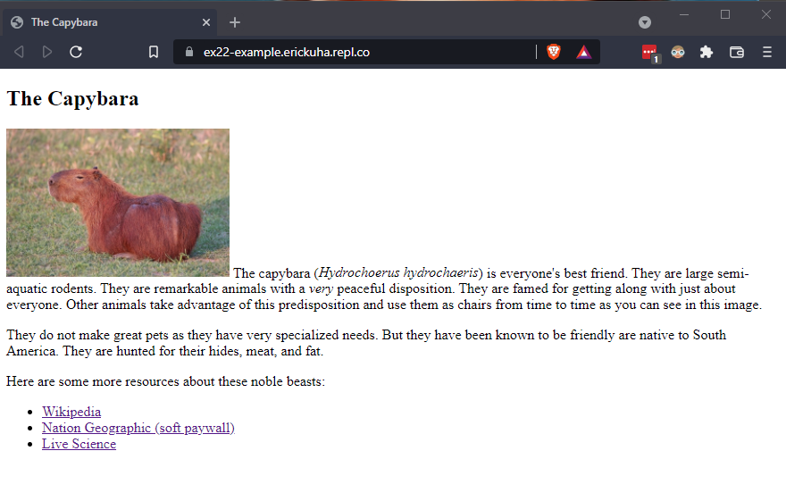

# Instructions  

Let's practice building a web page from first principles. You're going to build a page from the ground up as practice for building the basic skeleton of a web page.

Make a simple web page about a topic that interests you. Choose a topic that you know enough about to write a couple paragraphs about. Some possible topics might include:

* An animal or other organism.
* A hobby
* A person you admire (historical or otherwise)

Next, construct an encyclopedic page about that topic. It does not have to be comprehensive. Your web page must use as many of the tags we've covered as is reasonable. Use semantic organization tags as well. Some specific instructions:

* You must create the basic structure of the web page:
    * Doctype declaration
    * `<html>`, `<head>`, and `<body>` elements.
    * Basic `<meta>` tags, a `<title>` element, and everything in its appropriate place.
* Use heading tags (`<h1>` through `<h6>`) where appropriate.
* Your page must include at least one `` tag with the required attributes.
* Consider adding at least one of either a `<table>` or a `<list>` element.
* Try to use at least one `<em>` or `<strong>` element.
* Make use of the outlining elements (not all, but where appropriate) `<article>`, `<section>`, `<aside>`, or `<nav>`. Remember, even if they don't actually do anything by default, they will become very handy to have later when we start learning CSS.
* Include at least one link to an external source, which, of course, requires using an `<a>` element.

Here's an example of the level of complexity that we are looking for:

